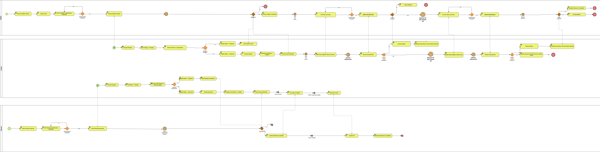
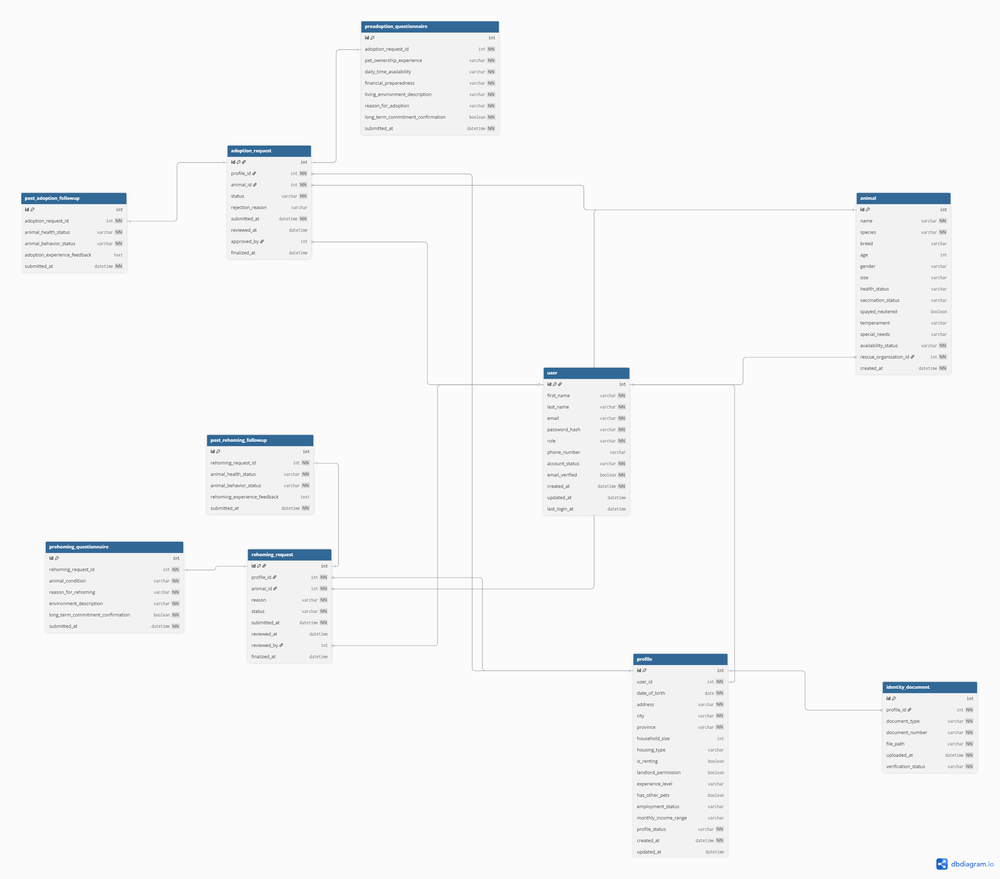

# Project Manifesto — PAWSTER

## 1. Project Title & One-Liner
**Project Title:** PAWSTER: Animal Rescue & Adoption Management System  
**One-Liner:**  
A web-based management system for Pawnagayat and adopters that ensures responsible, safe, and sustainable pet adoptions and rehoming through structured screening and approval workflows.

---

## 2. The Problem Statement
**For:**  
Pawnagayat and individuals seeking to adopt or rehome pets  

**Who wants to:**  
Safely match animals with responsible adopters or new owners while ensuring long-term animal welfare  

**Our project is a:**  
Web-based animal rescue and adoption management system  

**That provides:**  
A structured screening, verification, and approval process to reduce failed adoptions or rehomings and improve animal welfare.

---

## 3. User Persona

### User Persona 1: Adopter (Customer)
- **Name:** Alex Porter  
- **Role / Situation:**  
  A working professional who wants to adopt or rehome a rescued animal and is willing to go through a formal screening process to ensure responsible pet ownership.  

- **Goals:**  
  - Successfully adopt or rehome a pet through a rescue organization  
  - Clearly understand adoption/rehoming requirements and procedures  
  - Track the status of their adoption/rehoming request  

- **Frustrations:**  
  - Unclear or inconsistent adoption processes  
  - Long waiting times without updates  
  - Rejections without proper explanation  

### User Persona 2: Rescue Organization Admin (Service Provider)
- **Name:** JoyJoy Joseph Escorel  
- **Role / Situation:**  
  A shelter administrator responsible for reviewing adoption requests and ensuring animals are placed in safe, long-term homes.  

- **Goals:**  
  - Screen adopters and rehomers efficiently and fairly  
  - Reduce failed or returned adoptions/rehomings  
  - Maintain organized records of adoption and rehoming requests  

- **Frustrations:**  
  - Manual and time-consuming review processes  
  - Incomplete or inconsistent adopter/rehomer information  
  - Difficulty tracking request history and decisions  

---

## 4. Feature Prioritization (MoSCoW Method)

### Must Have (MVP Launch-Critical)
- Adopter user registration and login  
- ID upload and basic profile verification  
- Pre-adoption / pre-rehoming questionnaire form  
- Admin approval / rejection workflow  
- Adoption / Rehoming request status tracking (Pending / Approved / Rejected)  

### Should Have (Important, but not for V1)
- Admin dashboard with filters and search for both adoption and rehoming requests  
- Email or in-app notification of decision  
- Adoption / Rehoming history per user  
- Basic analytics (approved vs rejected rates)  
- Post-adoption follow-up survey  

### Could Have (Nice Additions for the Future)
- In-app messaging between adopters and rescue organizations  
- Rating system for adopter responsibility  
- Map feature showing shelters and/or available pets with clickable markers  
- Optional: Filter by pet type or distance  
- Optional: Use user geolocation to suggest nearby shelters  

### Won’t Have (Explicitly Out of Scope for MVP)
- Mobile application version  
- AI-based adopter suitability scoring  
- Automated background checks via third-party APIs  
- Real-time GPS tracking of adopters or animals  

---

## 5. Core User Flow (BPMN and Text-Based BPMN Summary)

### 1. Login / Registration Screen
- **Actions:**  
  - Enter Email / Password to log in  
  - Or click “Register” to create a new account  

- **Edge Cases:**  
  - Invalid credentials → show error → stay on Login  
  - Missing required fields → block submission  

### 2. Adopter Profile Screen
- **Actions:**  
  - Fill in personal details (name, DOB, address, phone)  
  - Select household size, housing type, renting status  

- **Edge Cases:**  
  - Missing required fields → show validation errors → cannot proceed  
  - Optional fields left blank → proceed  

### 3. Identity Document Upload Screen
- **Actions:**  
  - Upload government-issued ID or verified documents  
  - Confirm upload success  

- **Edge Cases:**  
  - Invalid file type or missing file → show error → retry  
  - Multiple documents allowed → can upload later  

### 4A. Adoption Flow
#### 4A-1. Browse Animals Screen
- View animals available for adoption  
- Optional: Display map with shelters/animals  
- Select animal to adopt  

**Edge Cases:**  
- No animals available → show “No animals available”  

#### 4A-2. Pre-Adoption Questionnaire Screen
- Fill out experience, living situation, daily availability, finances  
- Confirm long-term commitment  

**Edge Cases:**  
- Incomplete → highlight missing fields → cannot submit  

#### 4A-3. Adoption Request Submission Screen
- Review selected animal & questionnaire  
- Submit request → status = Pending  

**Edge Cases:**  
- Network error → retry option  

#### 4A-4. Request Status Screen
- View status: Pending / Approved / Rejected  
- Receive notification when Admin reviews request  

**Edge Cases:**  
- Request rejected → show rejection reason  

#### 4A-5. Adoption Completion Screen
- Confirm adoption finalization  
- Optionally submit feedback  

#### 4A-6. Post-Adoption Follow-Up Screen
- System prompts adopter for surveys:  
  - 7 days after adoption → first check  
  - 30 days after adoption → second check  
- Questions: pet adjustment, health, behavior, satisfaction  
- Submit feedback → stored for admin review  

**Edge Cases:**  
- Survey not completed → system sends reminder  
- Partial submission → allow resuming later  

### 4B. Rehoming Flow
#### 4B-1. Select Animal to Rehome Screen
- Select animal(s) for rehoming  
- Optional: Display map with shelters/rehome centers  

**Edge Cases:**  
- No eligible animals → show “No animals available”  

#### 4B-2. Pre-Rehoming Questionnaire Screen
- Fill out reason for rehoming, health, special needs  
- Submit → required before request submission  

**Edge Cases:**  
- Missing fields → block submission  

#### 4B-3. Rehoming Request Submission Screen
- Submit rehoming request → status = Pending  

#### 4B-4. Request Status Screen
- View status: Pending / Approved / Rejected  
- Receive notification when Admin reviews request  

**Edge Cases:**  
- Request rejected → show rejection reason  

#### 4B-5. Rehoming Completion Screen
- Confirm rehoming finalization  
- Optionally submit feedback  

**Edge Cases:**  
- Feedback optional → workflow continues even if skipped  

### 5. Completion / Confirmation Screen
- Show successful adoption or rehoming confirmation  
- Optionally return to dashboard or browse more animals  
- Post-Adoption Follow-Up triggered automatically (7 and 30 days)  

---

## 6. High Level Data Schema

---
## 7. Proposed Tech Stack
- **Frontend:** HTML, CSS, JavaScript (Thymeleaf optional if using Spring Boot)  
- **Backend:** Java – Spring Boot  
- **Database:** MySQL or PostgreSQL  
- **Deployment:** University server / Localhost (for MVP)  

---

## 8. MVP Milestone Tracker (6-Week Plan)

### Week 1 – Requirements & System Design
- **Goal:** Establish a clear foundation for the MVP  
- **Deliverables:**  
  - Finalize PAWSTER requirements and MVP scope  
  - Create wireframes (login, adopter dashboard, admin dashboard)  
  - Design database schema (User, AdopterProfile, AdoptionRequest, Notification)  
  - Draft BPMN diagram for adoption flow  
  - Set up project repository and development environment  

### Week 2 – User Registration & Authentication
- **Goal:** Enable secure access for adopters and admins  
- **Deliverables:**  
  - Adopter/Rehomer and admin registration & login  
  - Role-based access control (ADOPTER / ADMIN)  
  - Password hashing and session handling  
  - Basic adopter dashboard layout  

### Week 3 – Adopter Profile & Adoption/Rehoming Request
- **Goal:** Allow adopters to submit adoption applications  
- **Deliverables:**  
  - Adopter profile creation  
  - Government ID upload  
  - Pre-adoption and Post-adoption questionnaire form  
  - Pre-Rehoming Questionnaire  
  - Adoption request submission  
  - Default request status set to Pending  

### Week 4 – Admin Review & Approval Workflow
- **Goal:** Enable shelter admins to evaluate applications  
- **Deliverables:**  
  - Admin dashboard for viewing pending requests  
  - View adopter profile, ID, and questionnaire responses  
  - Approve or reject adoption requests  
  - Update request status (Approved / Rejected)  

### Week 5 – Status Tracking, Notifications & Rehoming Requests
- **Goal:** Improve transparency and communication  
- **Deliverables:**  
  - Adopter request status tracking page  
  - Notification system for approval/rejection decisions  
  - Rehoming request submission (adopter → admin)  
  - Bug fixing and UI refinements  

### Week 6 – Testing, Documentation & MVP Readiness
- **Goal:** Prepare PAWSTER for demo and evaluation  
- **Deliverables:**  
  - End-to-end testing (register → submit → review → notify)  
  - Validation of data storage and workflows  
  - Fix critical bugs  
  - Final documentation and user guide  
  - MVP demo-ready system  

---

## 9. Definition of Done (DoD)

1. **User Registration & Authentication**  
   - Adopter registration works and new accounts are created  
   - Login functionality works for existing users  
   - Credentials are validated and stored securely  

2. **Adopter Profile & Identity Verification**  
   - Mandatory profile fields are required and validated  
   - Users can upload ID documents successfully  
   - Uploaded documents are stored and linked to the correct user  

3. **Adoption / Rehoming Request Workflow**  
   - Users can submit adoption requests  
   - Users can submit rehoming requests  
   - Pre-Adoption and Pre-Rehoming questionnaires are required and validated  
   - Requests are stored in the system with status = Pending  
   - Admin can approve or reject requests  
   - Request status updates correctly to Approved or Rejected  
   - Users are notified of decision (status change)  

4. **Request Status Tracking**  
   - Users can check the status of their adoption or rehoming requests (Pending / Approved / Rejected)  
   - System prevents users from bypassing required steps  

5. **Post-Adoption Follow-Up**  
   - Post-Adoption survey is triggered automatically after adoption completion  
   - 7 days post-adoption: first follow-up survey  
   - 30 days post-adoption: second follow-up survey  
   - Survey responses are stored for admin review  
   - Partial survey submissions can be resumed  

6. **Admin Workflow**  
   - Admin receives notification of pending adoption/rehoming requests  
   - Admin can review user profile, ID, and questionnaire responses  
   - Admin can approve or reject requests with reason  
   - Status updates are accurately reflected to users  

7. **Data Integrity & Security**  
   - Users can only view or modify their own requests and data  
   - Request data and survey responses are stored securely  
   - System ensures consistent status across adoption and rehoming workflows 

8. **Error Handling**  
   - System handles missing or invalid fields gracefully  
   - Required steps cannot be bypassed  

9. **No Showstoppers**  
   - No critical bugs prevent users from completing adoption or rehoming requests  
   - All core MVP features are fully functional end-to-end

